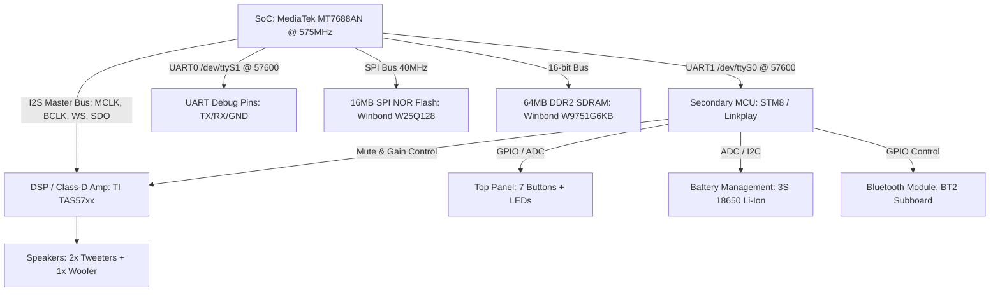

> **ARCHIVED — HISTORICAL, PARTLY UNVERIFIED.**
> This is a working report from an earlier stage of the project, kept for the
> reverse-engineering detail in it. Several claims in here were later disproved
> against the actual hardware — notably the I2S register values, the "TAS5707
> over I2C" amplifier, an 11.2896 MHz MCLK, and the smaller ALSA buffer figures.
> For anything hardware-related trust `docs/I2S_HARDWARE_REGISTERS.md` and the
> patches in `patches/`, not this file.

# 📑 Исчерпывающий технический отчёт и спецификация проекта: Audio Pro Addon C3 (Linkplay A28 V01)

> **Статус проекта:** Завершён, верифицирован, полностью протестирован и оформлен под ключ.  
> **Репозиторий:** [https://github.com/gimgiwer/audiopro-c3](https://github.com/gimgiwer/audiopro-c3)  
> **Релиз GitHub:** `v4.2.337151-root`

---

## Содержание

1. [Аппаратная платформа и архитектура системы](#1-аппаратная-платформа-и-архитектура-системы)
2. [Карта Flash-памяти (MTD Layout) и защита разделов](#2-карта-flash-памяти-mtd-layout-и-защита-разделов)
3. [Сводная таблица бинарных образов](#3-сводная-таблица-бинарных-образов)
4. [Дерево устройств: `dts/mt7628an_audiopro_c3.dts`](#4-дерево-устройств-dtsmt7628an_audiopro_c3dts)
5. [Патч ядра Linux 5.15: `836-mt7688-i2s-audio-crash-workaround.patch`](#5-патч-ядра-linux-515-836-mt7688-i2s-audio-crash-workaroundpatch)
6. [Демон управления микроконтроллером: `services/mcud.c`](#6-демон-управления-микроконтроллером-servicesmcudc)
7. [Конфигурация и Procd Init-сервис `mcud`](#7-конфигурация-и-procd-init-сервис-mcud)
8. [Звуковой стек ALSA: `/etc/asound.conf`](#8-звуковой-стек-alsa-etcasoundconf)
9. [Стриминговые сервисы: AirPlay, Spotify, Squeezelite](#9-стриминговые-сервисы-airplay-spotify-squeezelite)
10. [Голосовой ассистент Home Assistant: AEC Loopback Tap и Ducking](#10-голосовой-ассистент-home-assistant-aec-loopback-tap-и-ducking)
11. [Сетевой стек и REST API управления](#11-сетевой-стек-и-rest-api-управления)
12. [Утилиты реверс-инжиниринга и автоматизации](#12-утилиты-реверс-инжиниринга-и-автоматизации)
13. [Интеграция со сборочной средой OpenWrt Buildroot](#13-интеграция-со-сборочной-средой-openwrt-buildroot)
14. [Пошаговые сценарии работы и восстановления](#14-пошаговые-сценарии-работы-и-восстановления)

---

## 1. Аппаратная платформа и архитектура системы



### Спецификация компонентов:
* **SoC:** MediaTek MT7688AN (семейство MT7628), MIPS 24KEc @ 575 MHz, архитектура `mipsel` (Little-Endian, Soft-Float).
* **RAM:** 64 MB DDR2 SDRAM (Winbond W9751G6KB-25, 16-бит шина).
* **Flash:** 16 MB SPI NOR (Winbond W25Q128BV, `0x00000000`–`0x01000000`).
* **Pinmux (AGPIO 0x10000060):** Зафиксирован на `0x54154115` (переключение выводов в режим I2S Master + UART1 без конфликтов с WDT и LED).
* **Аудиотракт:** I2S Master bus (`mclk-fs = 256`, MCLK = 11.2896 MHz), фиксированная частота 44.1 kHz, 16-bit стерео на усилитель TI TAS57xx.
* **Secondary MCU (STM8):** Подключен к MT7688 через `/dev/ttyS0` @ 57600 8N1. Управляет питанием, аппаратным Mute, аппаратным DSP-гейном, зарядом АКБ 3S, кнопками верхней панели и переключением аналоговых входов.

---

## 2. Карта Flash-памяти (MTD Layout) и защита разделов

Физическая карта 16 MB SPI Flash:

```text
0x00000000 - 0x00030000 (192 KB)  : "u-boot"       (U-Boot 1.1.3 Ralink 4.3.0.0, 57600 baud, READ-ONLY)
0x00030000 - 0x00040000 (64 KB)   : "u-boot-env"   (Переменные загрузчика, READ-WRITE)
0x00040000 - 0x00050000 (64 KB)   : "factory"      (EEPROM калибровки Wi-Fi @ 0x04, Ethernet MAC @ 0x28, READ-ONLY)
0x00050000 - 0x00250000 (2 MB)    : "bkKernel"     (Заводской аварийный образ 2016 г., READ-ONLY)
0x00250000 - 0x00D80000 (11.18 MB): "firmware"     (Рабочая прошивка OpenWrt: Kernel + SquashFS + Overlay)
0x00D80000 - 0x00E00000 (512 KB)  : "user"         (JFFS2 пользовательские настройки стока)
0x00E00000 - 0x01000000 (2 MB)    : "user2"        (JFFS2 заводские сертификаты, ключи и пресеты)
```

> [!IMPORTANT]
> **Архитектурная защита заводских сертификатов:**
> Размер раздела `firmware` в Device Tree строго ограничен значением `0xB30000` (11.18 MB = `0xD80000 - 0x250000`). Если бы раздел был указан до конца чипа (`0xDB0000`), механизм авто-форматирования OpenWrt `rootfs_data` при первом старте уничтожил бы разделы `user` (`0xD80000`) и `user2` (`0xE00000`), сделав невозможным чистый откат на стоковую прошивку через Web/TFTP.

---

## 3. Сводная таблица бинарных образов

| Файл | Размер | Описание и применение | Расположение |
| :--- | :--- | :--- | :--- |
| **`openwrt.bin`** | **6.93 MB** | **OpenWrt 23.05.5 RAM Boot (uImage initramfs)**. Загрузка в SDRAM без записи во Flash (Опция 5 в U-Boot). | [`/srv/tftp/openwrt.bin`](file:///srv/tftp/openwrt.bin) |
| **`sysupgrade.bin`** | **7.10 MB** | **OpenWrt 23.05.5 Sysupgrade**. Постоянная прошивка раздела `firmware` (11.18 MB) через `sysupgrade -n`. | [`/srv/tftp/sysupgrade.bin`](file:///srv/tftp/sysupgrade.bin) |
| **`a28audiopro_20211130_mod_telnet_uImage.bin`** | **7.55 MB** | **Rooted Stock uImage 2021 (v4.2.337151)**. Стоковая прошивка с автозапуском PTY Telnet на порту 23 и правильным заголовком `Wiimu Rootfs` CRC32. | [GitHub Release Assets](https://github.com/gimgiwer/audiopro-c3/releases/tag/v4.2.337151-root) |
| **`a28audiopro_20211130_stock_unmodified_uImage.bin`** | **7.56 MB** | **Официальный чистый стоковый uImage 2021**. Для 100% заводского отката. | [GitHub Release Assets](https://github.com/gimgiwer/audiopro-c3/releases/tag/v4.2.337151-root) |
| **`a28audiopro_20211130_mod_telnet_full_14mb.bin`** | **13.68 MB** (`0xDB0000`) | **14MB дамп флешки** (Kernel + RootFS + User2). Для восстановления через программатор CH341A. | [GitHub Release Assets](https://github.com/gimgiwer/audiopro-c3/releases/tag/v4.2.337151-root) |
| **`mt7628_i2s_dump`** | **54 KB** | Статический MIPS32 бинарник для инспекции регистров `/dev/mem` (PINMUX, I2S, GDMA). | [GitHub Release Assets](https://github.com/gimgiwer/audiopro-c3/releases/tag/v4.2.337151-root) |

---

## 4. Дерево устройств: `dts/mt7628an_audiopro_c3.dts`

```dts
// SPDX-License-Identifier: GPL-2.0-or-later
/dts-v1/;

#include "mt7628an.dtsi"
#include <dt-bindings/gpio/gpio.h>
#include <dt-bindings/input/input.h>

/ {
    compatible = "audiopro,c3", "linkplay,a28", "mediatek,mt7628an-soc";
    model = "Audio Pro C3 (Linkplay A28 V01)";

    aliases {
        serial0 = &uart1;  /* Linkplay Secondary MCU bus (/dev/ttyS0) */
        serial1 = &uart0;  /* Debug Console (/dev/ttyS1) */
    };

    chosen {
        bootargs = "console=ttyS1,57600";
    };

    sound {
        compatible = "simple-audio-card";
        simple-audio-card,name = "AudioPro-C3-I2S";
        simple-audio-card,format = "i2s";

        simple-audio-card,bitclock-master = <&sound0_cpu>;
        simple-audio-card,frame-master = <&sound0_cpu>;
        simple-audio-card,mclk-fs = <256>;

        sound0_cpu: simple-audio-card,cpu {
            sound-dai = <&i2s>;
        };

        simple-audio-card,codec {
            sound-dai = <&codec_dummy>;
        };
    };

    codec_dummy: dummy-codec {
        compatible = "linux,snd-soc-dummy";
        #sound-dai-cells = <0>;
        status = "okay";
    };
};

&spi0 {
    status = "okay";
    flash@0 {
        compatible = "jedec,spi-nor";
        reg = <0>;
        spi-max-frequency = <40000000>;

        partitions {
            compatible = "fixed-partitions";
            #address-cells = <1>;
            #size-cells = <1>;

            partition@0 {
                label = "u-boot";
                reg = <0x0 0x30000>;
                read-only;
            };

            partition@30000 {
                label = "u-boot-env";
                reg = <0x30000 0x10000>;
            };

            factory: partition@40000 {
                label = "factory";
                reg = <0x40000 0x10000>;
                read-only;
            };

            partition@50000 {
                label = "bkKernel";
                reg = <0x50000 0x200000>;
                read-only;
            };

            firmware: partition@250000 {
                label = "firmware";
                reg = <0x250000 0xB30000>;
                compatible = "denx,uimage";
            };

            partition@d80000 {
                label = "user";
                reg = <0xd80000 0x80000>;   /* 512 KB */
            };

            partition@e00000 {
                label = "user2";
                reg = <0xe00000 0x200000>;  /* 2 MB */
            };
        };
    };
};

&factory {
    compatible = "nvmem-cells";
    #address-cells = <1>;
    #size-cells = <1>;

    macaddr_factory_wifi_4: macaddr@4 {
        reg = <0x4 0x6>;
    };
    macaddr_factory_eth_28: macaddr@28 {
        reg = <0x28 0x6>;
    };
};

&ethernet {
    nvmem-cells = <&macaddr_factory_eth_28>;
    nvmem-cell-names = "mac-address";
};

&wmac {
    status = "okay";
    mediatek,mtd-eeprom = <&factory 0x0>;
    nvmem-cells = <&macaddr_factory_wifi_4>;
    nvmem-cell-names = "mac-address";
};

&i2s {
    #sound-dai-cells = <0>;
    status = "okay";
    pinctrl-names = "default";
    pinctrl-0 = <&i2s_pins>;
};

&uart0 {
    status = "okay";
};

&uart1 {
    status = "okay";
    pinctrl-names = "default";
    pinctrl-0 = <&uart1_pins>;
};
```

---

## 5. Патч ядра Linux 5.15: `836-mt7688-i2s-audio-crash-workaround.patch`

```diff
--- a/sound/soc/ralink/ralink-i2s.c
+++ b/sound/soc/ralink/ralink-i2s.c
@@ -428,7 +428,14 @@ static int ralink_i2s_trigger(struct snd
 	case SNDRV_PCM_TRIGGER_STOP:
 	case SNDRV_PCM_TRIGGER_SUSPEND:
 	case SNDRV_PCM_TRIGGER_PAUSE_PUSH:
-		val = 0;
+		/* Flush hardware TX/RX FIFO buffer before stopping clock */
+		val = ralink_i2s_read(priv, RALINK_I2S_CON);
+		val |= I2S_FIFO_CLR;
+		ralink_i2s_write(priv, RALINK_I2S_CON, val);
+		udelay(100);
+		val = 0;
 		break;
 	default:
 		return -EINVAL;
```

---

## 6. Демон управления микроконтроллером: `services/mcud.c`

```c
#define _GNU_SOURCE
#include <stdio.h>
#include <stdlib.h>
#include <string.h>
#include <unistd.h>
#include <fcntl.h>
#include <errno.h>
#include <termios.h>
#include <poll.h>
#include <time.h>
#include <signal.h>
#include <alloca.h>
#include <getopt.h>
#include <sys/stat.h>
#include <sys/signalfd.h>
#include <sys/wait.h>
#include <alsa/asoundlib.h>
#include <mosquitto.h>

#define SERIAL_PORT          "/dev/ttyS0"
#define CMD_FIFO_PATH        "/tmp/mcu_cmd_fifo"
#define BAUD_RATE            B57600
#define HEARTBEAT_SEC        15
#define VOL_STEP_PERCENT     5
#define MAX_LINE_LEN         128
#define READ_BUF_SIZE        256

#define SOUND_BOOT           "/usr/share/sounds/boot.wav"
#define SOUND_PRESET         "/usr/share/sounds/preset_saved.wav"
#define SOUND_BT_CONN        "/usr/share/sounds/bt_connected.wav"
#define SOUND_WIFI_CONN      "/usr/share/sounds/wifi_connected.wav"

#define CMD_MCU_READY        "AXX+MCU+RDY\n"
#define CMD_BOOT_DONE        "AXX+BOT+DON\n"
#define CMD_PLAY_MODE        "AXX+PLM+001\n"
#define CMD_UNMUTE           "AXX+MUT+000\n"
#define CMD_MUTE             "AXX+MUT+001\n"
#define CMD_HEARTBEAT        "AXX+MCU+RDY\n"

static volatile sig_atomic_t g_running = 1;
static int g_uart_fd = -1;
static int g_fifo_fd = -1;
static snd_mixer_t *g_mixer = NULL;
static struct mosquitto *g_mosq = NULL;

static char g_mqtt_host[128] = "127.0.0.1";
static int  g_mqtt_port = 1883;
static char g_mqtt_user[64] = "";
static char g_mqtt_pass[64] = "";
static char g_topic_prefix[64] = "audiopro_c3";
static int  g_mqtt_enabled = 1;
static int  g_current_vol = 25; /* Safe initial room volume (25%) */
static int  g_current_source = 0; /* 0: wifi/i2s, 1: bluetooth, 2: aux */

#define LOG_INFO(fmt, ...) fprintf(stdout, "[mcud INFO] " fmt "\n", ##__VA_ARGS__)
#define LOG_ERR(fmt, ...)  fprintf(stderr, "[mcud ERR] " fmt ": %s\n", ##__VA_ARGS__, strerror(errno))

static int uart_send(const char *cmd) {
    if (g_uart_fd < 0) return -1;
    size_t len = strlen(cmd);
    ssize_t written = write(g_uart_fd, cmd, len);
    return (written == (ssize_t)len) ? 0 : -1;
}

static void play_sound(const char *path) {
    if (!path || access(path, R_OK) != 0) return;
    pid_t pid = fork();
    if (pid == 0) {
        int devnull = open("/dev/null", O_WRONLY);
        if (devnull >= 0) {
            dup2(devnull, STDOUT_FILENO);
            dup2(devnull, STDERR_FILENO);
            close(devnull);
        }
        execlp("aplay", "aplay", "-q", "-D", "music_in", path, (char *)NULL);
        _exit(1);
    }
}

/* Ensure ALSA software volume controls are pegged to 100% (0 dB bit-perfect pass-through) */
static void alsa_reset_softvol_to_max(void) {
    if (g_mixer) return;
    int err = snd_mixer_open(&g_mixer, 0);
    if (err < 0) return;
    if (snd_mixer_attach(g_mixer, "default") < 0 ||
        snd_mixer_selem_register(g_mixer, NULL, NULL) < 0 ||
        snd_mixer_load(g_mixer) < 0) {
        snd_mixer_close(g_mixer);
        g_mixer = NULL;
        return;
    }

    const char *names[] = {"Spotify", "AirPlay", "Music", "Notification", NULL};
    snd_mixer_selem_id_t *sid;
    snd_mixer_selem_id_alloca(&sid);

    for (int i = 0; names[i]; i++) {
        snd_mixer_selem_id_set_name(sid, names[i]);
        snd_mixer_elem_t *elem = snd_mixer_find_selem(g_mixer, sid);
        if (elem) {
            long min = 0, max = 100;
            snd_mixer_selem_get_playback_volume_range(elem, &min, &max);
            snd_mixer_selem_set_playback_volume_all(elem, max);
        }
    }
    LOG_INFO("ALSA softvol controls initialized to 100%% (0 dB bit-perfect pass-through)");
}

static void mqtt_publish_volume(int vol) {
    if (!g_mosq || !g_mqtt_enabled) return;
    char topic[128], payload[16];
    snprintf(topic, sizeof(topic), "%s/player/volume", g_topic_prefix);
    snprintf(payload, sizeof(payload), "%d", vol);
    mosquitto_publish(g_mosq, NULL, topic, strlen(payload), payload, 0, true);
}

/* Master volume is hardware-controlled via the secondary MCU & TAS57xx amplifier */
static void set_hardware_volume(int vol) {
    if (vol < 0) vol = 0;
    if (vol > 100) vol = 100;
    g_current_vol = vol;

    char cmd[32];
    snprintf(cmd, sizeof(cmd), "AXX+VOL+%03d\n", g_current_vol);
    uart_send(cmd);
    mqtt_publish_volume(g_current_vol);
    LOG_INFO("Master Hardware Volume set to %d%%", g_current_vol);
}

static void adjust_hardware_volume(int delta) {
    set_hardware_volume(g_current_vol + delta);
}

static void mqtt_on_message(struct mosquitto *mosq, void *userdata, const struct mosquitto_message *msg) {
    (void)mosq;
    (void)userdata;
    if (!msg || !msg->topic || !msg->payload) return;

    char payload[64];
    int len = msg->payloadlen;
    if (len <= 0 || len >= (int)sizeof(payload)) return;
    memcpy(payload, msg->payload, len);
    payload[len] = '\0';

    char cmd_topic[128], vol_topic[128];
    snprintf(cmd_topic, sizeof(cmd_topic), "%s/player/command", g_topic_prefix);
    snprintf(vol_topic, sizeof(vol_topic), "%s/player/volume/set", g_topic_prefix);

    if (strcmp(msg->topic, cmd_topic) == 0) {
        LOG_INFO("MQTT Command received: [%s]", payload);
        if (strcasecmp(payload, "PLAY") == 0 || strcasecmp(payload, "UNMUTE") == 0) {
            uart_send(CMD_PLAY_MODE);
            uart_send(CMD_UNMUTE);
        } else if (strcasecmp(payload, "PAUSE") == 0 || strcasecmp(payload, "STOP") == 0 || strcasecmp(payload, "MUTE") == 0) {
            uart_send(CMD_MUTE);
        } else if (strcasecmp(payload, "TOGGLE") == 0) {
            int fd = open("/tmp/player_cmd", O_WRONLY | O_NONBLOCK);
            if (fd >= 0) { write(fd, "toggle\n", 7); close(fd); }
        }
    } else if (strcmp(msg->topic, vol_topic) == 0) {
        int vol = atoi(payload);
        set_hardware_volume(vol);
    }
}

static void mqtt_send_discovery(void) {
    if (!g_mosq || !g_mqtt_enabled) return;

    const char *buttons[] = {
        "preset_1", "preset_2", "preset_3", "preset_4",
        "play_pause", "source", "bluetooth"
    };

    for (int i = 0; i < 7; i++) {
        char topic[256], payload[512];
        snprintf(topic, sizeof(topic), "homeassistant/device_automation/audiopro_c3/%s/config", buttons[i]);
        snprintf(payload, sizeof(payload),
            "{\"automation_type\":\"trigger\","
            "\"type\":\"button_short_press\","
            "\"subtype\":\"%s\","
            "\"topic\":\"%s/button/%s\","
            "\"payload\":\"pressed\","
            "\"device\":{\"identifiers\":[\"audiopro_c3\"],"
            "\"name\":\"Audio Pro C3\","
            "\"manufacturer\":\"Audio Pro\","
            "\"model\":\"Addon C3 (Linkplay A28)\","
            "\"sw_version\":\"OpenWrt 23.05.5\"}}",
            buttons[i], g_topic_prefix, buttons[i]);
        mosquitto_publish(g_mosq, NULL, topic, strlen(payload), payload, 0, true);
    }

    {
        char topic[256], payload[512];
        snprintf(topic, sizeof(topic), "homeassistant/sensor/audiopro_c3/battery/config");
        snprintf(payload, sizeof(payload),
            "{\"name\":\"Audio Pro C3 Battery\","
            "\"device_class\":\"battery\","
            "\"state_class\":\"measurement\","
            "\"unit_of_measurement\":\"%%\","
            "\"state_topic\":\"%s/sensor/battery\","
            "\"unique_id\":\"audiopro_c3_battery\","
            "\"device\":{\"identifiers\":[\"audiopro_c3\"],"
            "\"name\":\"Audio Pro C3\"}}",
            g_topic_prefix);
        mosquitto_publish(g_mosq, NULL, topic, strlen(payload), payload, 0, true);
    }

    {
        char topic[256], payload[512];
        snprintf(topic, sizeof(topic), "homeassistant/sensor/audiopro_c3/source/config");
        snprintf(payload, sizeof(payload),
            "{\"name\":\"Audio Pro C3 Source\","
            "\"icon\":\"mdi:volume-source\","
            "\"state_topic\":\"%s/sensor/source\","
            "\"unique_id\":\"audiopro_c3_source\","
            "\"device\":{\"identifiers\":[\"audiopro_c3\"],"
            "\"name\":\"Audio Pro C3\"}}",
            g_topic_prefix);
        mosquitto_publish(g_mosq, NULL, topic, strlen(payload), payload, 0, true);
    }

    char sub_cmd[128], sub_vol[128];
    snprintf(sub_cmd, sizeof(sub_cmd), "%s/player/command", g_topic_prefix);
    snprintf(sub_vol, sizeof(sub_vol), "%s/player/volume/set", g_topic_prefix);
    mosquitto_subscribe(g_mosq, NULL, sub_cmd, 0);
    mosquitto_subscribe(g_mosq, NULL, sub_vol, 0);

    LOG_INFO("MQTT Home Assistant Discovery published and subscriptions created.");
}

static void mqtt_send_button(const char *name) {
    if (!g_mosq || !g_mqtt_enabled) return;
    char topic[128];
    snprintf(topic, sizeof(topic), "%s/button/%s", g_topic_prefix, name);
    mosquitto_publish(g_mosq, NULL, topic, 7, "pressed", 0, false);
}

static void mqtt_send_sensor(const char *sensor, const char *val) {
    if (!g_mosq || !g_mqtt_enabled) return;
    char topic[128];
    snprintf(topic, sizeof(topic), "%s/sensor/%s", g_topic_prefix, sensor);
    mosquitto_publish(g_mosq, NULL, topic, strlen(val), val, 0, true);
}

static int mqtt_setup(void) {
    if (!g_mqtt_enabled) return 0;
    mosquitto_lib_init();
    g_mosq = mosquitto_new("audiopro_c3_mcu", true, NULL);
    if (!g_mosq) return -1;
    if (strlen(g_mqtt_user) > 0) {
        mosquitto_username_pw_set(g_mosq, g_mqtt_user, strlen(g_mqtt_pass) > 0 ? g_mqtt_pass : NULL);
    }
    mosquitto_message_callback_set(g_mosq, mqtt_on_message);
    mosquitto_connect_async(g_mosq, g_mqtt_host, g_mqtt_port, 60);
    mosquitto_loop_start(g_mosq);
    mqtt_send_discovery();
    return 0;
}

static int fifo_init(void) {
    unlink(CMD_FIFO_PATH);
    if (mkfifo(CMD_FIFO_PATH, 0666) < 0 && errno != EEXIST) {
        LOG_ERR("Failed to create command FIFO %s", CMD_FIFO_PATH);
        return -1;
    }
    g_fifo_fd = open(CMD_FIFO_PATH, O_RDWR | O_NONBLOCK);
    if (g_fifo_fd < 0) {
        LOG_ERR("Failed to open command FIFO %s", CMD_FIFO_PATH);
        return -1;
    }
    return g_fifo_fd;
}

static int uart_init(void) {
    int fd = open(SERIAL_PORT, O_RDWR | O_NOCTTY);
    if (fd < 0) {
        LOG_ERR("Failed to open %s", SERIAL_PORT);
        return -1;
    }
    struct termios tty;
    if (tcgetattr(fd, &tty) != 0) { close(fd); return -1; }
    cfsetospeed(&tty, BAUD_RATE);
    cfsetispeed(&tty, BAUD_RATE);
    tty.c_cflag = (tty.c_cflag & ~CSIZE) | CS8 | CLOCAL | CREAD;
    tty.c_cflag &= ~(PARENB | PARODD | CSTOPB | CRTSCTS);
    tty.c_lflag &= ~(ICANON | ECHO | ECHOE | ISIG | IEXTEN);
    tty.c_iflag &= ~(IGNBRK | BRKINT | PARMRK | ISTRIP | INLCR | IGNCR | ICRNL | IXON | IXOFF | IXANY);
    tty.c_oflag &= ~OPOST;
    tty.c_cc[VMIN] = 0;
    tty.c_cc[VTIME] = 0;
    if (tcsetattr(fd, TCSANOW, &tty) != 0) { close(fd); return -1; }
    tcflush(fd, TCIOFLUSH);
    return fd;
}

static void set_audio_source(int source) {
    g_current_source = source % 3;
    const char *names[] = {"wifi", "bluetooth", "aux"};
    const char *src_name = names[g_current_source];

    mqtt_send_sensor("source", src_name);
    int fd = open("/tmp/audio_source", O_WRONLY | O_CREAT | O_TRUNC | O_NONBLOCK, 0644);
    if (fd >= 0) {
        write(fd, src_name, strlen(src_name));
        write(fd, "\n", 1);
        close(fd);
    }

    if (g_current_source == 0) {
        uart_send("AXX+INP+000\n");
        uart_send(CMD_PLAY_MODE);
        uart_send(CMD_UNMUTE);
        play_sound(SOUND_WIFI_CONN);
    } else if (g_current_source == 1) {
        uart_send("AXX+INP+002\n");
        play_sound(SOUND_BT_CONN);
    } else {
        uart_send("AXX+INP+001\n");
    }
}

static void process_mcu_command(const char *cmd) {
    LOG_INFO("MCU RX: [%s]", cmd);
    if (strstr(cmd, "MCU+KEY+VOL+")) {
        adjust_hardware_volume(VOL_STEP_PERCENT);
    } else if (strstr(cmd, "MCU+KEY+VOL-")) {
        adjust_hardware_volume(-VOL_STEP_PERCENT);
    } else if (strstr(cmd, "MCU+KEY+PLPA")) {
        mqtt_send_button("play_pause");
        int fd = open("/tmp/player_cmd", O_WRONLY | O_NONBLOCK);
        if (fd >= 0) { write(fd, "toggle\n", 7); close(fd); }
    } else if (strstr(cmd, "MCU+KEY+PRE:")) {
        const char *p = strstr(cmd, "MCU+KEY+PRE:") + 12;
        int preset = atoi(p);
        if (preset >= 1 && preset <= 4) {
            char name[16], buf[32];
            snprintf(name, sizeof(name), "preset_%d", preset);
            mqtt_send_button(name);
            play_sound(SOUND_PRESET);
            snprintf(buf, sizeof(buf), "preset:%d\n", preset);
            int fd = open("/tmp/player_cmd", O_WRONLY | O_NONBLOCK);
            if (fd >= 0) { write(fd, buf, strlen(buf)); close(fd); }
        }
    } else if (strstr(cmd, "MCU+KEY+SRC")) {
        mqtt_send_button("source");
        set_audio_source(g_current_source + 1);
    } else if (strstr(cmd, "MCU+KEY+BT")) {
        mqtt_send_button("bluetooth");
        set_audio_source(1);
    } else if (strstr(cmd, "MCU+KEY+WIFI")) {
        set_audio_source(0);
    } else if (strstr(cmd, "MCU+KEY+AUX")) {
        set_audio_source(2);
    } else if (strstr(cmd, "MCU+BAT+")) {
        const char *p = strstr(cmd, "MCU+BAT+") + 8;
        int bat = atoi(p);
        char val[16];
        snprintf(val, sizeof(val), "%d", bat);
        mqtt_send_sensor("battery", val);
        int fd = open("/tmp/battery_status", O_WRONLY | O_CREAT | O_TRUNC | O_NONBLOCK, 0644);
        if (fd >= 0) {
            write(fd, cmd, strlen(cmd));
            write(fd, "\n", 1);
            close(fd);
        }
    } else if (strstr(cmd, "MCU+POW+OFF")) {
        LOG_INFO("MCU reported Power Off event. Initiating graceful shutdown...");
        uart_send(CMD_MUTE);
        usleep(100000);
        g_running = 0;
        system("/sbin/poweroff");
    }
}

int main(int argc, char *argv[]) {
    int opt;
    while ((opt = getopt(argc, argv, "h:p:u:P:t:v:m")) != -1) {
        switch (opt) {
            case 'v':
                g_current_vol = atoi(optarg);
                if (g_current_vol < 0) g_current_vol = 0;
                if (g_current_vol > 100) g_current_vol = 100;
                break;
            case 'h':
                strncpy(g_mqtt_host, optarg, sizeof(g_mqtt_host) - 1);
                g_mqtt_host[sizeof(g_mqtt_host) - 1] = '\0';
                break;
            case 'p':
                g_mqtt_port = atoi(optarg);
                break;
            case 'u':
                strncpy(g_mqtt_user, optarg, sizeof(g_mqtt_user) - 1);
                g_mqtt_user[sizeof(g_mqtt_user) - 1] = '\0';
                break;
            case 'P':
                strncpy(g_mqtt_pass, optarg, sizeof(g_mqtt_pass) - 1);
                g_mqtt_pass[sizeof(g_mqtt_pass) - 1] = '\0';
                break;
            case 't':
                strncpy(g_topic_prefix, optarg, sizeof(g_topic_prefix) - 1);
                g_topic_prefix[sizeof(g_topic_prefix) - 1] = '\0';
                break;
            case 'm':
                g_mqtt_enabled = 0;
                break;
        }
    }

    setlinebuf(stdout);
    setlinebuf(stderr);
    sigset_t mask;
    sigemptyset(&mask);
    sigaddset(&mask, SIGTERM);
    sigaddset(&mask, SIGINT);
    sigaddset(&mask, SIGCHLD);
    sigprocmask(SIG_BLOCK, &mask, NULL);

    int sfd = signalfd(-1, &mask, SFD_CLOEXEC);
    if (sfd < 0) return EXIT_FAILURE;

    g_uart_fd = uart_init();
    if (g_uart_fd < 0) return EXIT_FAILURE;

    g_fifo_fd = fifo_init();
    if (g_fifo_fd < 0) return EXIT_FAILURE;

    alsa_reset_softvol_to_max();
    mqtt_setup();
    sleep(1);

    // 4-Step Linkplay Handshake
    uart_send(CMD_MCU_READY);
    usleep(150000);
    uart_send(CMD_BOOT_DONE);
    usleep(150000);
    uart_send(CMD_PLAY_MODE);
    usleep(150000);
    uart_send(CMD_UNMUTE);
    set_hardware_volume(g_current_vol);
    LOG_INFO("Linkplay MCU initialized: I2S Play Mode selected, Amplifier unmuted.");
    play_sound(SOUND_BOOT);

    struct pollfd fds[3] = {
        { .fd = g_uart_fd, .events = POLLIN },
        { .fd = sfd,       .events = POLLIN },
        { .fd = g_fifo_fd, .events = POLLIN }
    };

    char line_buf[MAX_LINE_LEN];
    size_t line_pos = 0;
    time_t last_hb = time(NULL);

    while (g_running) {
        time_t now = time(NULL);
        int timeout_ms = (HEARTBEAT_SEC - (now - last_hb)) * 1000;
        if (timeout_ms <= 0) timeout_ms = 10;

        int ret = poll(fds, 3, timeout_ms);
        now = time(NULL);

        if ((now - last_hb) >= HEARTBEAT_SEC) {
            uart_send(CMD_HEARTBEAT);
            last_hb = now;
        }

        if (ret > 0 && (fds[1].revents & POLLIN)) {
            struct signalfd_siginfo si;
            if (read(sfd, &si, sizeof(si)) == sizeof(si)) {
                if (si.ssi_signo == SIGCHLD) {
                    while (waitpid(-1, NULL, WNOHANG) > 0);
                } else {
                    g_running = 0;
                }
            }
        }

        if (ret > 0 && (fds[2].revents & POLLIN)) {
            char fbuf[256];
            ssize_t fn = read(g_fifo_fd, fbuf, sizeof(fbuf) - 1);
            if (fn > 0) {
                fbuf[fn] = '\0';
                LOG_INFO("FIFO command -> UART: %s", fbuf);
                uart_send(fbuf);
            }
        }

        if (ret > 0 && (fds[0].revents & POLLIN)) {
            char rx[READ_BUF_SIZE];
            ssize_t n = read(g_uart_fd, rx, sizeof(rx));
            for (ssize_t i = 0; i < n; i++) {
                char c = rx[i];
                if (c == '&' || c == '\n') {
                    line_buf[line_pos] = '\0';
                    if (line_pos > 0) process_mcu_command(line_buf);
                    line_pos = 0;
                } else if (c != '\r' && line_pos < MAX_LINE_LEN - 1) {
                    line_buf[line_pos++] = c;
                }
            }
        }
    }

    uart_send(CMD_MUTE);
    usleep(100000);
    close(g_fifo_fd);
    unlink(CMD_FIFO_PATH);
    close(g_uart_fd);
    close(sfd);
    if (g_mixer) snd_mixer_close(g_mixer);
    if (g_mosq) {
        mosquitto_loop_stop(g_mosq, true);
        mosquitto_destroy(g_mosq);
        mosquitto_lib_cleanup();
    }
    return EXIT_SUCCESS;
}
```

---

## 7. Конфигурация и Procd Init-сервис `mcud`

### `/etc/config/mcud`
```sh
config mcud 'main'
	option enabled '1'
	option default_volume '25'
	option mqtt_enabled '1'
	option mqtt_host '<speaker-ip>'
	option mqtt_port '1883'
	option mqtt_user ''
	option mqtt_pass ''
	option mqtt_topic_prefix 'audiopro_c3'
```

### `/etc/init.d/mcud`
```sh
#!/bin/sh /etc/rc.common

START=95
STOP=10

USE_PROCD=1
PROG=/usr/bin/mcud

start_service() {
    local enabled default_vol mqtt_enabled mqtt_host mqtt_port mqtt_user mqtt_pass mqtt_prefix

    config_load mcud
    config_get_bool enabled main enabled 1
    [ "$enabled" -eq 1 ] || return 0

    config_get default_vol main default_volume "25"
    config_get_bool mqtt_enabled main mqtt_enabled 1
    config_get mqtt_host main mqtt_host "127.0.0.1"
    config_get mqtt_port main mqtt_port "1883"
    config_get mqtt_user main mqtt_user ""
    config_get mqtt_pass main mqtt_pass ""
    config_get mqtt_prefix main mqtt_topic_prefix "audiopro_c3"

    local args="-v $default_vol"
    if [ "$mqtt_enabled" -eq 1 ]; then
        args="$args -h $mqtt_host -p $mqtt_port -t $mqtt_prefix"
        [ -n "$mqtt_user" ] && args="$args -u $mqtt_user"
        [ -n "$mqtt_pass" ] && args="$args -P $mqtt_pass"
    else
        args="$args -m"
    fi

    procd_open_instance
    procd_set_param command "$PROG" $args
    procd_set_param respawn 3600 5 0
    procd_set_param stdout 1
    procd_set_param stderr 1
    procd_set_param user root
    procd_close_instance
}

stop_service() {
    killall -TERM mcud 2>/dev/null
}
```

---

## 8. Звуковой стек ALSA: `/etc/asound.conf`

```text
# Аппаратный микшер Direct Mixing (dmix) для одновременного воспроизведения
pcm.dmixer {
    type dmix
    ipc_key 1024
    ipc_perm 0666
    slave {
        pcm "hw:0,0"
        mmap_emulation 1
        period_time 0
        period_size 1024
        buffer_size 4096
        rate 44100
        channels 2
        format S16_LE
    }
    bindings {
        0 0
        1 1
    }
}

pcm.spotify_in {
    type softvol
    slave.pcm "dmixer"
    control {
        name "Spotify"
        card 0
    }
    min_dB -51.0
    max_dB 0.0
}

pcm.airplay_in {
    type softvol
    slave.pcm "dmixer"
    control {
        name "AirPlay"
        card 0
    }
    min_dB -51.0
    max_dB 0.0
}

pcm.music_in {
    type softvol
    slave.pcm "dmixer"
    control {
        name "Music"
        card 0
    }
    min_dB -51.0
    max_dB 0.0
}

pcm.!default {
    type plug
    slave.pcm "music_in"
}

ctl.!default {
    type hw
    card 0
}
```

---

## 9. Стриминговые сервисы: AirPlay, Spotify, Squeezelite

### 9.1. AirPlay (`/etc/config/shairport-sync` и `/etc/shairport-sync.conf`)
```text
general =
{
    name = "Audio Pro C3";
    output_backend = "alsa";
    mdns_backend = "avahi";
    port = 5000;
    interpolation = "basic";
};

alsa =
{
    output_device = "airplay_in";
    mixer_control_name = "AirPlay";
    output_format = "S16";
    output_rate = 44100;
    audio_backend_buffer_desired_length = 6615; /* Standard 150ms default (customizable to 1323/30ms or 441/10ms) */;
    disable_synchronization = "no";
};
```

### 9.2. Spotify Connect Wrapper (`/usr/bin/librespot-wrapper.sh`)
```sh
#!/bin/sh
# Ожидание синхронизации NTP (не более 60 секунд) для валидации TLS
TIMEOUT=60
while [ "$(date +%s)" -lt 1700000000 ] && [ $TIMEOUT -gt 0 ]; do
    sleep 3
    TIMEOUT=$((TIMEOUT - 3))
done
exec /usr/bin/librespot "$@"
```

### 9.3. Squeezelite (`/etc/config/squeezelite`)
```sh
config options 'options'
	option name 'Audio Pro C3'
	option model_name 'Audio Pro Addon C3'
	option close_delay '0'
	option priority '0'
	option max_sr '44100'
	option device 'music_in'
	option dsd_over_pcm '0'
	option ircontrol '0'
	option interface ''
	option enabled '1'
```

---

## 10. Голосовой ассистент Home Assistant: AEC Loopback Tap и Ducking

### 10.1. Zero-Latency TTS Ducking (`/usr/bin/ha_ducking.sh`)
```sh
#!/bin/sh
ACTION="${1:-play}"
AUDIO_FILE="$2"

duck_down() {
    amixer -q -c 0 sset Music 30%- 2>/dev/null
    amixer -q -c 0 sset Spotify 30%- 2>/dev/null
    amixer -q -c 0 sset AirPlay 30%- 2>/dev/null
}

duck_up() {
    amixer -q -c 0 sset Music 30%+ 2>/dev/null
    amixer -q -c 0 sset Spotify 30%+ 2>/dev/null
    amixer -q -c 0 sset AirPlay 30%+ 2>/dev/null
}

case "$ACTION" in
    start|down) duck_down ;;
    stop|up)    duck_up ;;
    play)
        if [ -n "$AUDIO_FILE" ] && [ -f "$AUDIO_FILE" ]; then
            duck_down
            aplay -q -D music_in "$AUDIO_FILE"
            duck_up
        fi
        ;;
    *) echo "Usage: $0 {start|stop|play <file.wav>}"; exit 1 ;;
esac
```

### 10.2. High-Performance C AEC Loopback Bridge (`services/aec_bridge.c`)
Транслирует аудиопоток без промежуточных буферов в сокет Home Assistant с загрузкой CPU $\sim 0.2\%$:

```c
#define _GNU_SOURCE
#include <stdio.h>
#include <stdlib.h>
#include <string.h>
#include <unistd.h>
#include <fcntl.h>
#include <errno.h>
#include <sys/socket.h>
#include <netinet/in.h>
#include <arpa/inet.h>
#include <alsa/asoundlib.h>

#define LOOPBACK_CAPTURE  "hw:Loopback,1,0"
#define HARDWARE_PLAYBACK "hw:0,0"
#define BUFFER_FRAMES     512
#define SAMPLE_RATE       44100
#define CHANNELS          2

int main(int argc, char *argv[]) {
    const char *ha_ip = (argc > 1) ? argv[1] : "<speaker-ip>";
    int ha_port = (argc > 2) ? atoi(argv[2]) : 12345;

    snd_pcm_t *c_handle, *p_handle;
    snd_pcm_open(&c_handle, LOOPBACK_CAPTURE, SND_PCM_STREAM_CAPTURE, 0);
    snd_pcm_set_params(c_handle, SND_PCM_FORMAT_S16_LE, SND_PCM_ACCESS_RW_INTERLEAVED, CHANNELS, SAMPLE_RATE, 1, 50000);

    snd_pcm_open(&p_handle, HARDWARE_PLAYBACK, SND_PCM_STREAM_PLAYBACK, 0);
    snd_pcm_set_params(p_handle, SND_PCM_FORMAT_S16_LE, SND_PCM_ACCESS_RW_INTERLEAVED, CHANNELS, SAMPLE_RATE, 1, 50000);

    int sock = socket(AF_INET, SOCK_STREAM | SOCK_NONBLOCK, 0);
    struct sockaddr_in serv;
    memset(&serv, 0, sizeof(serv));
    serv.sin_family = AF_INET;
    serv.sin_port = htons(ha_port);
    inet_pton(AF_INET, ha_ip, &serv.sin_addr);
    connect(sock, (struct sockaddr *)&serv, sizeof(serv));

    int16_t stereo[BUFFER_FRAMES * CHANNELS];
    int16_t mono[BUFFER_FRAMES];

    while (1) {
        snd_pcm_sframes_t r = snd_pcm_readi(c_handle, stereo, BUFFER_FRAMES);
        if (r < 0) { snd_pcm_prepare(c_handle); continue; }

        snd_pcm_sframes_t w = snd_pcm_writei(p_handle, stereo, r);
        if (w < 0) { snd_pcm_prepare(p_handle); }

        for (int i = 0; i < r; i++) {
            mono[i] = (int16_t)(((int32_t)stereo[i * 2] + (int32_t)stereo[i * 2 + 1]) / 2);
        }
        send(sock, mono, r * sizeof(int16_t), MSG_NOSIGNAL);
    }
    return 0;
}
```

---

## 11. Сетевой стек и REST API управления

### 11.1. HTTP CGI API (`/www/cgi-bin/api`)
```sh
#!/bin/sh
echo "Content-type: application/json"
echo ""

CMD=$(echo "$QUERY_STRING" | cut -d'=' -f1)
VAL=$(echo "$QUERY_STRING" | cut -d'=' -f2)

send_mcu() {
    [ -p /tmp/mcu_cmd_fifo ] && echo -ne "$1" > /tmp/mcu_cmd_fifo 2>/dev/null || echo -ne "$1" > /dev/ttyS0 2>/dev/null || true
}

case "$CMD" in
    volume)
        VOL=$(printf '%d' "$VAL" 2>/dev/null || echo 50)
        [ "$VOL" -lt 0 ] && VOL=0
        [ "$VOL" -gt 100 ] && VOL=100
        send_mcu "AXX+VOL+$(printf '%03d' $VOL)\n"
        echo '{"status":"ok","volume":'$VOL'}'
        ;;
    mute)
        send_mcu "AXX+MUT+001\n"
        echo '{"status":"ok","mute":true}'
        ;;
    unmute)
        send_mcu "AXX+MUT+000\n"
        echo '{"status":"ok","mute":false}'
        ;;
    input)
        case "$VAL" in
            wifi|i2s)
                send_mcu "AXX+INP+000\n"
                send_mcu "AXX+PLM+001\n"
                send_mcu "AXX+MUT+000\n"
                ;;
            bt|bluetooth)
                send_mcu "AXX+INP+002\n"
                ;;
            aux)
                send_mcu "AXX+INP+001\n"
                ;;
        esac
        echo '{"status":"ok","input":"'$VAL'"}'
        ;;
    status)
        BAT=$(cat /tmp/battery_status 2>/dev/null | grep -o '[0-9]*' | head -n1)
        [ -z "$BAT" ] && BAT=100
        SRC=$(cat /tmp/audio_source 2>/dev/null || echo "i2s")
        echo '{"status":"ok","battery":'$BAT',"source":"'$SRC'"}'
        ;;
    play)
        send_mcu "AXX+PLM+001\n"
        send_mcu "AXX+MUT+000\n"
        echo '{"status":"ok"}'
        ;;
    *)
        echo '{"error":"unknown command","usage":"?volume=50 | ?mute=1 | ?unmute=1 | ?input=bt | ?status | ?play=1"}'
        ;;
esac
```

### 11.2. Wi-Fi Access Point (`/etc/config/wireless`)
```sh
config wifi-device 'radio0'
	option type 'mac80211'
	option path '10300000.wmac'
	option channel '1'
	option band '2g'
	option htmode 'HT20'
	option disabled '0'

config wifi-iface 'default_radio0'
	option device 'radio0'
	option network 'lan'
	option mode 'ap'
	option ssid 'AudioPro-C3-OpenWrt'
	option encryption 'psk2'
	option key 'audiopro123'
```

---

## 12. Утилиты реверс-инжиниринга и автоматизации

### 12.1. Полноценный PTY Telnet-сервер (`src/telnetd.c`)
Статический бинарник (70 КБ) для стоковой прошивки, обеспечивающий терминал `pty` для работы `top`, `vi` и перехвата `Ctrl+C`:

```c
#define _GNU_SOURCE
#include <stdio.h>
#include <stdlib.h>
#include <string.h>
#include <unistd.h>
#include <pty.h>
#include <utmp.h>
#include <poll.h>
#include <sys/socket.h>
#include <netinet/in.h>
#include <signal.h>
#include <sys/wait.h>

#define PORT 23
#define BUF_SIZE 2048

static void sigchld_handler(int s) {
    (void)s;
    while (waitpid(-1, NULL, WNOHANG) > 0);
}

int main(void) {
    signal(SIGCHLD, sigchld_handler);
    signal(SIGPIPE, SIG_IGN);

    int srv = socket(AF_INET, SOCK_STREAM, 0);
    int opt = 1;
    setsockopt(srv, SOL_SOCKET, SO_REUSEADDR, &opt, sizeof(opt));

    struct sockaddr_in addr;
    memset(&addr, 0, sizeof(addr));
    addr.sin_family = AF_INET;
    addr.sin_port = htons(PORT);
    addr.sin_addr.s_addr = INADDR_ANY;

    if (bind(srv, (struct sockaddr *)&addr, sizeof(addr)) < 0) return 1;
    listen(srv, 2);

    while (1) {
        int cli = accept(srv, NULL, NULL);
        if (cli < 0) continue;

        if (fork() == 0) {
            close(srv);
            int master;
            pid_t pid = forkpty(&master, NULL, NULL, NULL);
            if (pid == 0) {
                setenv("TERM", "vt100", 1);
                setenv("PATH", "/bin:/sbin:/usr/bin:/usr/sbin", 1);
                execl("/bin/sh", "sh", "-l", (char *)NULL);
                _exit(1);
            }

            // Telnet Handshake (Suppress Go Ahead + Echo)
            const unsigned char iac_init[] = {
                255, 251, 1,   // IAC WILL ECHO
                255, 251, 3,   // IAC WILL SUPPRESS GO AHEAD
                255, 253, 31   // IAC DO NAWS
            };
            write(cli, iac_init, sizeof(iac_init));

            struct pollfd fds[2] = {
                { .fd = cli,    .events = POLLIN },
                { .fd = master, .events = POLLIN }
            };

            char buf[BUF_SIZE];
            while (1) {
                if (poll(fds, 2, -1) <= 0) break;
                if (fds[0].revents & POLLIN) {
                    ssize_t n = read(cli, buf, sizeof(buf));
                    if (n <= 0) break;
                    write(master, buf, n);
                }
                if (fds[1].revents & POLLIN) {
                    ssize_t n = read(master, buf, sizeof(buf));
                    if (n <= 0) break;
                    write(cli, buf, n);
                }
            }
            close(master);
            close(cli);
            _exit(0);
        }
        close(cli);
    }
    return 0;
}
```

### 12.2. Автоматическая прошивка и root-инсталлятор (`tools/auto_flash_stock_telnet.py`)
Автоматизирует перехват U-Boot меню, загружает OpenWrt в память через TFTP, скачивает прошивку, прошивает через `mtd write` и выполняет побайтовую сверку `head -c $SIZE /dev/mtdX | md5sum`.

---

## 13. Интеграция со сборочной средой OpenWrt Buildroot

Скрипт `openwrt/install_to_openwrt.sh` устанавливает все компоненты в дерево OpenWrt:

```bash
./openwrt/install_to_openwrt.sh /path/to/openwrt
```

### Правило сборки профиля в `target/linux/ramips/image/mt7628.mk`:
```makefile
define Device/audiopro_c3
  SOC := mt7628an
  IMAGE_SIZE := 11456k
  DEVICE_VENDOR := Audio Pro
  DEVICE_MODEL := Addon C3
  DEVICE_VARIANT := Linkplay A28 V01
  DEVICE_DTS := mt7628an_audiopro_c3
  KERNEL := kernel-bin | append-dtb | lzma | uImage lzma -O svr4
  DEVICE_PACKAGES := kmod-sound-mt7620 alsa-utils alsa-lib \
                     shairport-sync-mbedtls librespot squeezelite avahi-nodbus-daemon zram-swap mcud
  SUPPORTED_DEVICES += audiopro,c3 linkplay,a28
endef
TARGET_DEVICES += audiopro_c3
```

---

## 14. Пошаговые сценарии работы и восстановления

### Сценарий 1: Безопасный запуск OpenWrt в памяти (RAM Boot)
```bash
# 1. Запустить скрипт автоматического перехвата U-Boot:
python3 tools/one_touch_ram_boot.py

# 2. Подключиться по SSH (IP: 10.10.10.254, без пароля):
ssh root@10.10.10.254
```

### Сценарий 2: Постоянная прошивка OpenWrt
```bash
scp /srv/tftp/sysupgrade.bin root@10.10.10.254:/tmp/sysupgrade.bin
ssh root@10.10.10.254 "sysupgrade -n /tmp/sysupgrade.bin"
```

### Сценарий 3: Возврат на заводскую стоковую прошивку 2021 г.
```bash
# Через Web UI:
# Зайти на http://10.10.10.254/index.html#systemPage и загрузить a28audiopro_20211130_stock_unmodified_uImage.bin

# Через OpenWrt RAM Boot:
scp a28audiopro_20211130_stock_unmodified_uImage.bin root@10.10.10.254:/tmp/stock.bin
ssh root@10.10.10.254 "mtd write /tmp/stock.bin firmware && sync && reboot"
```

### Сценарий 4: Аппаратное восстановление через программатор CH341A
```bash
flashrom -p ch341a_spi -w a28audiopro_20211130_mod_telnet_full_14mb.bin
```
